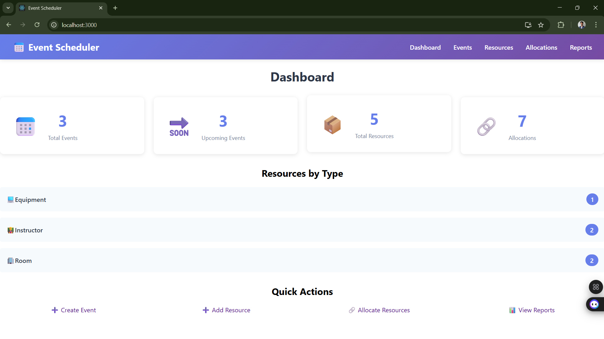
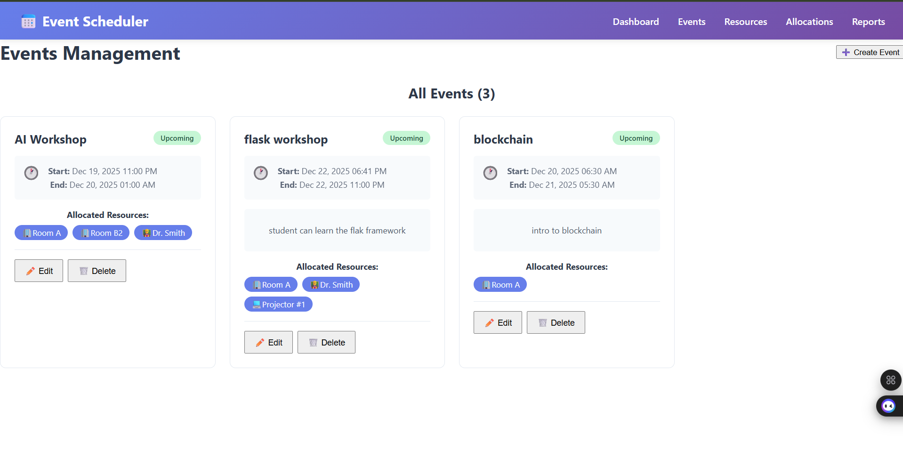
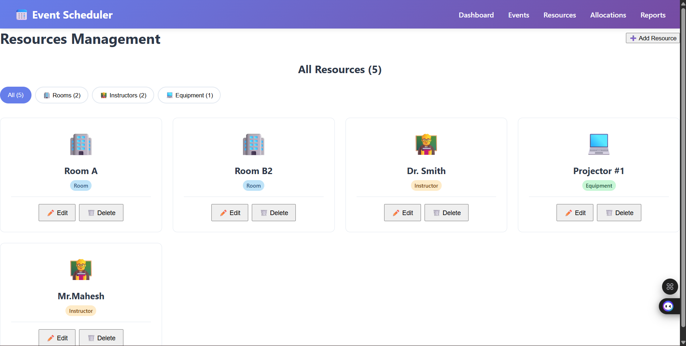
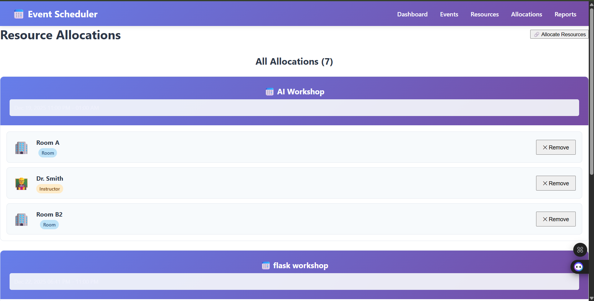
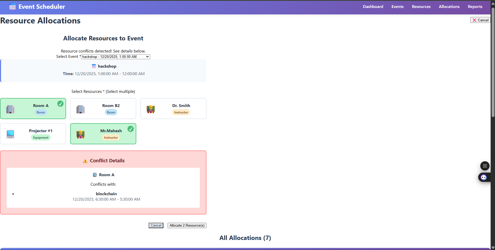

# 📅 Event Scheduling & Resource Allocation System

A full-stack web application that enables organizations to schedule events (workshops, seminars, classes) and allocate shared resources (rooms, instructors, equipment) while automatically preventing double-booking conflicts through intelligent time-based validation.

---

## 🎯 Project Overview

This system allows organizations to efficiently manage events and resources with robust conflict detection. Built with Flask (Python) backend and React frontend, it demonstrates practical implementation of database design, RESTful APIs, conflict resolution algorithms, and modern web development practices.

---

## ✨ Key Features

### 📆 Event Management
- Create, edit, view, and delete events with title, description, start time, and end time
- Visual status indicators: Upcoming, Ongoing, or Completed
- Validation for invalid time ranges and duration limits
- Automatic cascade deletion of related allocations

### 📦 Resource Management
- Manage three resource types: Rooms, Instructors, and Equipment
- Add, edit, view, and delete resources
- Filter resources by type for quick navigation
- Protection against deletion of allocated resources

### 🔍 Smart Conflict Detection
- Automatic validation prevents double-booking of resources
- Handles all edge cases:
  - Partial overlaps
  - Nested intervals (event within event)
  - Containing intervals (event surrounding another)
  - Exact time overlaps
- Adjacent events (end time = next start time) are allowed
- Clear error messages showing which resource conflicts with which event and when

### 📊 Reporting & Analytics
- **Resource Utilization Report**
  - Select custom date range
  - Filter by resource type (optional)
  - View total hours utilized per resource
  - See total bookings and upcoming booking count
  - Expand to view detailed upcoming bookings
- **Dashboard Summary**
  - Total events (upcoming vs. past)
  - Total resources and allocations
  - Resources breakdown by type
- **System Integrity Check**
  - Optional conflicts report to scan for any double bookings

---

## 📸 Screenshots

### Dashboard - System Overview

*Real-time statistics showing total events, resources, allocations, and resource breakdown by type*

### Events Management

*View all events with status badges, allocated resources, and quick edit/delete actions*

### Resource Management

*Manage rooms, instructors, and equipment with filtering by type*

### Resource Allocation with Conflict Detection

*Select events and resources - system automatically detects and displays conflicts*

### Conflict Detection in Action

*Clear visualization of time conflicts with details about overlapping events*

### Utilization Report

*Generate reports showing resource usage over custom date ranges with expandable details*

---

## 🎥 Demo Video

**Watch the complete walkthrough:** [View Demo on Google Drive](https://drive.google.com/drive/u/0/folders/1x_bU7HIubY1_nCXjdwF736OX2lcy7Srp)

The demo covers:
- Creating resources (rooms, instructors, equipment)
- Scheduling events with overlapping time windows
- Allocating resources and triggering conflict detection
- Viewing detailed conflict information
- Generating utilization reports

---

## 🛠️ Tech Stack

### Backend
- **Flask** - Python web framework
- **Flask-SQLAlchemy** - ORM for database operations
- **Flask-CORS** - Cross-origin resource sharing
- **SQLite** - Database (development) / PostgreSQL (production-ready)
- **Python 3.x** - Programming language

### Frontend
- **React** - JavaScript library for building UI
- **React Router DOM** - Client-side routing
- **Axios** - HTTP client for API calls
- **date-fns** - Date/time formatting
- **CSS3** - Modern styling with gradients and animations

### Architecture
- RESTful API design
- Component-based React architecture
- Modular Flask blueprints
- Service layer pattern for API communication
- Factory pattern for Flask app initialization

---

## 📊 Database Schema

### Tables

**Event**

event_id (Primary Key)

title (String, required)

start_time (DateTime, required)

end_time (DateTime, required)

description (Text, optional)

created_at (DateTime, auto)

text

**Resource**
resource_id (Primary Key)

resource_name (String, required, unique)

resource_type (Enum: room|instructor|equipment)

created_at (DateTime, auto)

text

**EventResourceAllocation** (Join Table)
allocation_id (Primary Key)

event_id (Foreign Key → Event)

resource_id (Foreign Key → Resource)

allocated_at (DateTime, auto)

UNIQUE constraint on (event_id, resource_id)

text

### Relationships
- One-to-Many: Event → EventResourceAllocation
- One-to-Many: Resource → EventResourceAllocation
- Cascade delete on event removal

---

## ⚙️ Installation & Setup

### Prerequisites
- Python 3.8+
- Node.js 14+
- npm or yarn
- Git

### Backend Setup

Navigate to backend folder
cd backend

Create virtual environment
python -m venv venv

Activate virtual environment
Windows:
venv\Scripts\activate

Mac/Linux:
source venv/bin/activate

Install dependencies
pip install -r requirements.txt

(Optional) Load sample data
python test_data.py

Start Flask server
python app.py

text

Backend will run on `http://localhost:5000`

### Frontend Setup

Navigate to frontend folder
cd frontend

Install dependencies
npm install

Start React development server
npm start

text

Frontend will run on `http://localhost:3000`

---

## 🚀 Usage Guide

### 1. Manage Resources

1. Navigate to **Resources** page
2. Click **"➕ Add Resource"**
3. Enter resource name (e.g., "Room A1", "Dr. Smith", "Projector #1")
4. Select resource type (Room / Instructor / Equipment)
5. Click **"Add Resource"**

### 2. Create Events

1. Navigate to **Events** page
2. Click **"➕ Create Event"**
3. Fill in:
   - Event title
   - Start date and time
   - End date and time
   - Description (optional)
4. Click **"Create Event"**

### 3. Allocate Resources (Conflict Detection)

1. Navigate to **Allocations** page
2. Click **"🔗 Allocate Resources"**
3. Select an event from dropdown
4. Select one or more resources
5. Click **"Allocate"**
6. If conflict exists:
   - System shows error with conflict details
   - View which resource conflicts with which event
   - See exact time overlap
7. If no conflict:
   - Resources successfully allocated
   - Allocation appears in the list

### 4. Generate Reports

1. Navigate to **Reports** page
2. Select start date and end date
3. (Optional) Filter by resource type
4. Click **"📊 Generate Report"**
5. View utilization data:
   - Total hours per resource
   - Number of bookings
   - Click "👁️ View" to expand upcoming bookings

---

## 🔧 API Endpoints

### Events
- `GET /api/events` - Get all events
- `GET /api/events/:id` - Get single event
- `POST /api/events` - Create event
- `PUT /api/events/:id` - Update event
- `DELETE /api/events/:id` - Delete event

### Resources
- `GET /api/resources` - Get all resources
- `GET /api/resources/:id` - Get single resource
- `POST /api/resources` - Create resource
- `PUT /api/resources/:id` - Update resource
- `DELETE /api/resources/:id` - Delete resource
- `GET /api/resources/types` - Get resource types

### Allocations
- `GET /api/allocations` - Get all allocations
- `POST /api/allocations` - Create single allocation
- `POST /api/allocations/batch` - Create multiple allocations
- `DELETE /api/allocations/:id` - Remove allocation
- `POST /api/allocations/conflicts` - Check conflicts (preview)

### Reports
- `GET /api/reports/utilization` - Resource utilization report
- `GET /api/reports/conflicts` - System conflicts check
- `GET /api/reports/summary` - Dashboard summary

---

## 📁 Project Structure

event-scheduler/
│
├── backend/
│ ├── app.py # Flask app entry point
│ ├── config.py # Configuration settings
│ ├── models.py # SQLAlchemy database models
│ ├── test_data.py # Sample data seeding script
│ ├── requirements.txt # Python dependencies
│ ├── .env # Environment variables
│ │
│ ├── routes/ # API endpoints (Blueprints)
│ │ ├── init.py
│ │ ├── events.py # Event CRUD operations
│ │ ├── resources.py # Resource CRUD operations
│ │ ├── allocations.py # Allocation with conflict detection
│ │ └── reports.py # Reporting and analytics
│ │
│ └── utils/ # Utility functions
│ ├── init.py
│ └── conflict.py # Conflict detection algorithms
│
├── frontend/
│ ├── public/
│ │ └── index.html
│ │
│ ├── src/
│ │ ├── components/ # Reusable components
│ │ │ ├── Navbar.jsx
│ │ │ ├── Navbar.css
│ │ │ ├── EventForm.jsx
│ │ │ ├── EventForm.css
│ │ │ ├── EventList.jsx
│ │ │ ├── EventList.css
│ │ │ ├── ResourceForm.jsx
│ │ │ ├── ResourceForm.css
│ │ │ ├── ResourceList.jsx
│ │ │ ├── ResourceList.css
│ │ │ ├── AllocationForm.jsx
│ │ │ ├── AllocationForm.css
│ │ │ ├── AllocationList.jsx
│ │ │ ├── AllocationList.css
│ │ │ ├── UtilizationReport.jsx
│ │ │ └── UtilizationReport.css
│ │ │
│ │ ├── pages/ # Page components
│ │ │ ├── Dashboard.jsx
│ │ │ ├── Dashboard.css
│ │ │ ├── EventsPage.jsx
│ │ │ ├── EventsPage.css
│ │ │ ├── ResourcesPage.jsx
│ │ │ ├── AllocationsPage.jsx
│ │ │ └── ReportsPage.jsx
│ │ │
│ │ ├── services/ # API service layer
│ │ │ └── api.js
│ │ │
│ │ ├── App.js # Main app component
│ │ ├── App.css # Global styles
│ │ └── index.js # Entry point
│ │
│ ├── package.json # Node dependencies
│ └── package-lock.json
│
├── assets/ # Project assets
│ ├── screenshots/ # Application screenshots
│ │ ├── dashboard.png
│ │ ├── events.png
│ │ ├── resources.png
│ │ ├── allocations.png
│ │ └── reports.png
│ └── demo/ # Demo materials
│
├── README.md # This file
└── .gitignore # Git ignore rules

undefined
---

## 🧠 Conflict Detection Algorithm

The system uses a mathematical approach to detect time overlaps:

**Two time intervals overlap if:**
Interval A: [start_A, end_A]
Interval B: [start_B, end_B]

Overlap condition: start_A < end_B AND end_A > start_B

text

**Handles all edge cases:**
- ✅ Partial overlap (events overlap partially)
- ✅ Nested intervals (one event completely inside another)
- ✅ Containing intervals (one event completely contains another)
- ✅ Exact time match
- ✅ Adjacent events (end_A == start_B) are allowed

**Implementation:**
def check_resource_conflict(resource_id, start_time, end_time, exclude_event_id=None):
conflicts = db.session.query(Event, EventResourceAllocation).join(
EventResourceAllocation, Event.event_id == EventResourceAllocation.event_id
).filter(
EventResourceAllocation.resource_id == resource_id,
Event.start_time < end_time, # Existing starts before our end
Event.end_time > start_time # Existing ends after our start
).all()

text
return len(conflicts) == 0, conflicts
text

---

## 🎓 Learning Outcomes

This project demonstrates:

- ✅ **Full-stack development** - Backend and frontend integration
- ✅ **RESTful API design** - Clean, structured endpoints
- ✅ **Database modeling** - Relational schema with proper relationships
- ✅ **Algorithm implementation** - Conflict detection logic
- ✅ **State management** - React hooks and component architecture
- ✅ **Error handling** - Comprehensive validation and user feedback
- ✅ **UI/UX design** - Responsive, intuitive interface
- ✅ **Code organization** - Modular, maintainable structure

---

## 🧪 Testing

### Manual Test Cases

**Test Case 1: Create Overlapping Events**
1. Create Event A: Dec 20, 10:00 AM - 12:00 PM
2. Create Event B: Dec 20, 11:00 AM - 1:00 PM
3. Try allocating same resource to both
4. **Expected:** Conflict detected with 1-hour overlap (11:00-12:00)

**Test Case 2: Adjacent Events (No Conflict)**
1. Create Event A: Dec 20, 10:00 AM - 12:00 PM
2. Create Event B: Dec 20, 12:00 PM - 2:00 PM
3. Allocate same resource to both
4. **Expected:** Success (end time = start time is allowed)

**Test Case 3: Nested Events**
1. Create Event A: Dec 20, 10:00 AM - 4:00 PM
2. Create Event B: Dec 20, 12:00 PM - 2:00 PM (inside A)
3. Try allocating same resource
4. **Expected:** Conflict detected (B is completely inside A)

---

## 🚧 Future Enhancements

- [ ] User authentication and authorization
- [ ] Email notifications for upcoming events
- [ ] Calendar view for events
- [ ] Recurring events support
- [ ] Resource availability calendar
- [ ] Export reports to PDF/Excel
- [ ] Mobile responsive design improvements
- [ ] Real-time updates using WebSockets
- [ ] Multi-tenant support for different organizations
- [ ] Advanced filtering and search

---

## 🤝 Contributing

Contributions are welcome! If you'd like to improve this project:

1. Fork the repository
2. Create a feature branch (`git checkout -b feature/AmazingFeature`)
3. Commit your changes (`git commit -m 'Add some AmazingFeature'`)
4. Push to the branch (`git push origin feature/AmazingFeature`)
5. Open a Pull Request

---

## 📝 License

This project is open source and available under the MIT License.

---

## 👨‍💻 Author

**Your Name**

- GitHub: [@yourusername](https://github.com/yourusername)
- LinkedIn: [Your LinkedIn](https://linkedin.com/in/yourprofile)
- Email: your.email@example.com

---

## 🙏 Acknowledgments

- Project developed as part of college placement training program
- Built to demonstrate full-stack development skills
- Special thanks to mentors and peers for feedback

---

## 📞 Support

If you have any questions or need help with setup, please open an issue or contact me directly.

**Project Link:** [https://github.com/yourusername/event-scheduler](https://github.com/yourusername/event-scheduler)

---

⭐ **If you found this project helpful, please give it a star!** ⭐